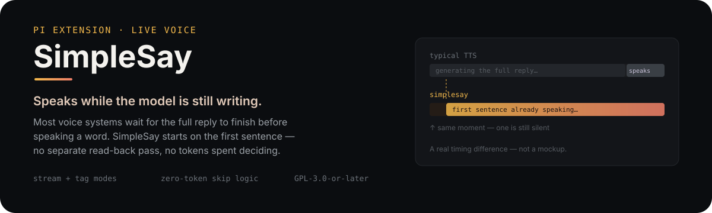
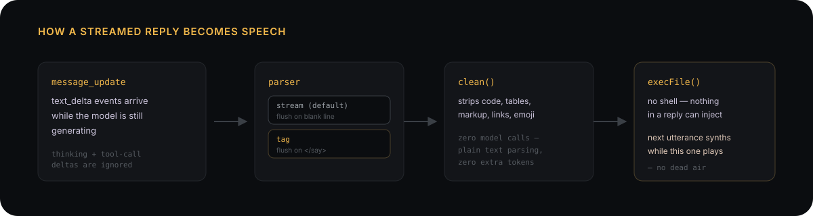

<p align="center">
  
</p>

[Pi](https://pi.dev) is a terminal coding agent that supports extensions, small TypeScript/JavaScript modules that hook into its lifecycle to add commands, tools, and behavior. SimpleSay is one such extension: it voices an agent's replies automatically by watching the response stream.

## Why this is different

Most voice systems, including ones from large AI companies, wait for the
entire response to finish generating before speech starts. SimpleSay speaks
**live, while the model is still writing**: the first paragraph or `<say>`
span is already playing back before the reply is done streaming. No
waiting on a full response, no separate "now read this back" pass.

It also decides what's worth saying **without spending any tokens on the
decision**. `stream` mode's skip logic (code blocks, tables, non-prose) is
plain text parsing over the streamed output as it arrives. It is not a model
call, not a tool the LLM has to remember to invoke, and nothing added to
the context window to make it happen. The model just writes normally; the
extension decides what's speech-worthy for free, out-of-band.

`tag` mode goes a step further: instead of relying on tool-calling to
trigger speech, which routinely fails on smaller local models that miss
or malform tool calls, the agent just wraps text it wants spoken in
`<say>…</say>`. Plain text markers are far more reliable than a structured
tool call for a small model, and they give you direct, fine-grained control
over phrasing and tone in the prompt itself, right down to models that
couldn't reliably drive a `say` tool at all.

Underneath both modes it's a deliberately small, unopinionated tool: no
bundled TTS engine, no required cloud service, just a documented shell-out
contract. Point it at anything, whether a local model, a cloud voice API, or
`espeak`, and wire up whatever behavior you want around it.

## Modes
- **`stream`** (default): no tags, zero agent config. The reply is spoken paragraph by
  paragraph as it streams, with code, tables, and non-prose skipped.
- **`tag`**: the agent wraps spoken text in `<say>…</say>`; spans are spoken live and the
  tags are stripped from the transcript. Requires the agent to emit the markers.

Switch at runtime: `/simplesay mode <tag|stream>` — the choice persists across
sessions (stored in `~/.pi/agent/simplesay.json`). To silence speech entirely
without uninstalling, `/simplesay disable` mutes everything (and cuts off
anything already playing); `/simplesay enable` turns it back on. The on/off
state persists across sessions too (`/simplesay on` / `off` also work). Run
`/simplesay` with no arguments to see the current state: enabled/disabled,
mode, where the voice plays (`output=local|server`), agent, endpoint, and config path.

## Install / run

This repo follows the pi package layout: `package.json` declares
`pi.extensions = ["./src"]`, with the entrypoint at `src/index.ts`.

Install from npm once published:

```bash
pi install npm:pi-simplesay
```

Install from GitHub:

```bash
pi install git:github.com/studioschade/pi-simplesay      # global
# or
pi install git:github.com/studioschade/pi-simplesay -l   # project-local
```

For a manual source checkout, symlink `src/index.ts` into pi's extension
auto-discovery path (recommended, so this repo stays the single source of truth):

```bash
ln -s /path/to/pi-simplesay/src/index.ts ~/.pi/agent/extensions/simplesay.ts   # global
# or
ln -s /path/to/pi-simplesay/src/index.ts .pi/extensions/simplesay.ts           # project-local
```

To try it ad hoc without installing: `pi -e /path/to/pi-simplesay/src/index.ts`

## How it works

<p align="center">
  
</p>

- **Streaming input:** `pi.on("message_update")` delivers `assistantMessageEvent`, a
  union whose text arrives as `{ type: "text_delta", delta }`. Deltas feed the active
  mode's parser. Thinking and tool-call deltas are ignored, so neither is spoken.
- **Tag parser:** accumulates streamed text, keeps a short tail on every delta so a
  tag split across chunks is never missed, and speaks a span the moment `</say>`
  arrives.
- **Stream parser:** consumes complete lines, tracks fenced-code state, and flushes
  a paragraph on the blank line that ends it, or at message end.
- **Cleanup (`clean()`):** strips code blocks and spans, tables, `<say>` tags,
  headers, emphasis markers, links, images, bare URLs, wikilinks, blockquotes,
  bullets, and emoji, then collapses whitespace. Identifiers like `file_name` are
  preserved. Provider-agnostic normalization (spelling out numbers or years, custom
  lexicon) stays the endpoint's job, not the extension's.
- **Dispatch:** `execFile(endpoint, ...)`, with no shell involved, so backticks,
  `$(...)`, or quotes inside a reply can't break or execute anything. To avoid dead
  air between utterances, synthesis is pipelined ahead of playback: each utterance
  renders to a temp WAV (`SAY_OUT`) while the previous one is still playing, then
  plays in order via `--play`. The next paragraph starts the instant the current one
  finishes. Synthesis has a 90s timeout: a hung endpoint (e.g. a wedged TTS server)
  skips one utterance instead of silently freezing the queue for the whole session.
  Playback is spawned as its own session leader and `unref()`'d, with a
  `SIMPLESAY_PLAY_TIMEOUT_MS` (default 120 s) group-kill bound, and a
  `session_shutdown` handler kills any in-flight playback on quit — so a wedged
  audio player (hung PipeWire, absent device) can't hold Pi's event loop alive and
  orphan it on exit. Barge-in's group kill reaches the player too.
- **Interrupt-on-type (barge-in):** the input editor is wrapped so any keystroke
  stops current playback immediately and drops the rest of that reply's queued
  speech — start typing and the agent goes quiet. Speech state re-arms on pi's
  `message_start` event (which fires for every assistant message), not on the
  provider stream's `start` event: providers that never emit one would otherwise
  leave the mute flag stuck and drop entire replies silently.
- **Debug tracing:** one line per pipeline decision (events seen, utterances
  spoken or dropped and why, span failures, receipts) goes to
  `/tmp/simplesay-debug.log` by default; `SIMPLESAY_DEBUG=/path/to/log` relocates
  it and `SIMPLESAY_DEBUG=0` disables it. A silent session shows exactly where
  speech died. Span failures are written **only** here, never to the terminal via
  `console.*` (which would draw over the TUI); a tripped circuit-breaker shows as
  `voice PAUSED` in bare `/simplesay` status, with a retry countdown once it's a
  runtime trip (see **Circuit breaker & auto-retry** below).
- **Display rewrite (tag mode only):** `message_end` returns a replacement message
  (`MessageEndEventResult.message`) with the tags removed. `message_update` is
  live-only and can't be rewritten, so raw tags are visible for the instant they
  stream before vanishing once the message finalizes.

## Speech endpoint
SimpleSay ships no TTS engine. It shells out to a configurable endpoint with the
contract `<endpoint> [--agent <name>] "<text>"`. All structural text cleanup is done in
the extension, so any endpoint works.

With no configuration at all, it defaults to the bundled
[`examples/endpoint.sh`](examples/endpoint.sh) (a minimal cross-platform reference
endpoint using `say`/`espeak`/`spd-say`), resolved relative to the extension file so it
works regardless of current directory. Voice works out of the box on a fresh clone.

To pin your own endpoint (a shared TTS server, a specific voice setup, etc.) without
editing the source, set environment variables before starting Pi:
```bash
export SIMPLESAY_ENDPOINT=/path/to/your/say/script
export SIMPLESAY_AGENT=your-agent-name   # optional, defaults to 'fabricant'
export SIMPLESAY_PLAY_TIMEOUT_MS=120000  # optional, play-kill bound in ms (default 120s)
```
Or override for just the current session:
```
/simplesay <agent> <endpoint> [--no-agent]
```
Defaults: `mode` starts as `stream` and `enabled` as on, then both follow the
last `/simplesay mode` / `/simplesay enable|disable` choices saved to
`~/.pi/agent/simplesay.json`. `endpoint` reads `SIMPLESAY_ENDPOINT`
if set, otherwise the bundled example endpoint above. Voice identity reads
`SIMPLESAY_AGENT` if set, otherwise derives from a `~/Agents/<name>` working
directory when present, with `fabricant` only as the last-resort fallback.

## Where the voice plays: local or server

SimpleSay can deliver speech two ways, and you pick by where the speaker is:

| output | what happens | transport |
|---|---|---|
| **`local`** (default) | the endpoint returns a WAV and SimpleSay plays it **on this device** | WAV (`SAY_OUT` + `--play`) |
| **`server`** | each span is handed to the endpoint, which plays it **wherever it plays** (typically a TTS server's own speakers); nothing comes back | direct |

```
/simplesay output              # show the current output and where it came from (env, setting or default)
/simplesay output local        # play on this device (saved)
/simplesay output server       # let the endpoint/server play it (saved)
```

The choice is saved in `simplesay.json` and survives restarts. It is the same setting as
`/simplesay direct on|off` (`server` = `direct on`, `local` = `direct off`), so either
command works and existing configs behave exactly as before. The environment variable
`SIMPLESAY_DIRECT` overrides the saved choice for one process (`1` = server, `0` = local);
when it does, `/simplesay output` and bare `/simplesay` say so, e.g.
`output=server (env)`.

When to use which:

- **A laptop or handheld whose TTS runs on another machine:** `local`, with an endpoint
  that sends the text to the TTS machine and fetches the WAV back. You hear it from the
  device in your hands, and barge-in stops it instantly.
- **A desktop whose speakers are the server's** (the TTS box is the machine you sit at, or
  it drives the room speakers): `server`. Nothing is copied back; the server just speaks.

[`examples/endpoint-remote-ssh.sh`](examples/endpoint-remote-ssh.sh) is a generic endpoint
for the "TTS runs on another machine over SSH" case and handles both outputs:

```bash
export SIMPLESAY_ENDPOINT=/path/to/pi-simplesay/examples/endpoint-remote-ssh.sh
export SIMPLESAY_REMOTE_HOST=tts-server     # any ssh destination or ssh_config alias
export SIMPLESAY_REMOTE_CMD=say-return      # the command that runs on that host
```

In `local` it pipes the text (preceded by an `#instruction <tone>` line when the span has
a `tone=`) to `ssh "$SIMPLESAY_REMOTE_HOST" "$SIMPLESAY_REMOTE_CMD"`, writes the WAV the
remote command prints to `SAY_OUT` (via a `.part` file, refusing an empty result), and
plays it with the first of `pw-play`, `paplay`, `aplay` or `afplay`. In `server` it runs
`"$SIMPLESAY_REMOTE_CMD" --play-here` instead, so the server plays the audio itself. The
remote command is yours to write; `--play-here` is only the documented convention
(`SIMPLESAY_REMOTE_PLAY_FLAG` changes it). The script header spells out the full contract.
Text always travels on stdin, never on the remote command line.

## Direct transport

The default transport is the synth-ahead WAV pipeline above: the endpoint must write a
**regular, non-empty** file to `SAY_OUT`, or the span fails (logged, counted toward the
circuit-breaker) and never reaches `--play` — an exit code of 0 alone is not success.

Some endpoints cannot produce a WAV: a sandboxed agent whose endpoint hands the *text*
to a relay on the host, or a script that speaks directly. Those opt into the **direct**
transport instead of faking a file:

```bash
export SIMPLESAY_DIRECT=1        # force direct for this process
export SIMPLESAY_DIRECT=0        # force the WAV transport, even over a saved setting
```
```
/simplesay direct on|off         # saved in simplesay.json, used when SIMPLESAY_DIRECT is unset
```

Precedence: `SIMPLESAY_DIRECT=1`/`0` → the saved `direct` setting → default (WAV). Bare
`/simplesay` shows the result and its source, e.g. `output=server (env), transport=direct (env)`.
`/simplesay output local|server` is the same switch under user-facing names (see above). Saving mode
or enable/disable keeps the `direct` setting.

In direct mode, each speech span is **one** call, dispatched strictly in order (the next
span is not started until the previous call exits — no synth-ahead):

```
<endpoint> [--agent <name>] "<text>"      # SAY_INSTRUCTION as usual; SAY_OUT removed from the env
```

No temp WAV, no `--play`. An inherited `SAY_OUT` in Pi's own environment is explicitly
removed from the child's, so a WAV-capable endpoint cannot write a file nobody plays.
Each call runs as its own process group, bounded by `SIMPLESAY_DIRECT_TIMEOUT_MS`
(default 120 s, since a local direct endpoint may play before it exits). Termination is
bounded: the group gets SIGTERM, then SIGKILL after `SIMPLESAY_KILL_GRACE_MS` (default
1 s), which also reaches a TERM-ignoring descendant left behind by a wrapper that did
exit. The span's outcome is recorded the moment it is timed out or cancelled, but calls
never overlap: the next direct call (or `--play`) waits until the old process group is
gone, at most the grace plus `SIMPLESAY_REAP_MS` (default 500 ms) after SIGTERM. That
barrier holds across cancellation, `/simplesay disable`/`enable` and the next reply, so
progress is bounded rather than immediate.

The barrier **fails closed**. Only `ESRCH` proves a process group is gone. If signalling
the old group fails any other way (e.g. `EPERM`), or the group is still present at grace +
reap, the teardown is *unconfirmed*: a `teardown FAILED (unconfirmed)` line is logged and
speech is **held**. Queued spans settle as refused (nothing hangs), new spans are refused
at once, and bare `/simplesay` shows `speech HELD: teardown unconfirmed for group -<pgid>`.
`/simplesay enable` re-probes every held group and releases speech only when each one
returns `ESRCH`; otherwise it stays held and says why. Retry once the group is gone.
Shutdown still just kills and does not wait. A timeout counts as a failure and the queue
moves on; barge-in, `/simplesay
disable` and `session_shutdown` cancel the in-flight call and drop every span not yet
dispatched. The termination reason wins over the exit code: an endpoint that exits 0 on
SIGTERM still gets a failure (timeout) or a cancellation, never `accepted`, and never
resets the circuit-breaker. In both transports the breaker is also checked when a span is
dispatched, so spans already queued when it trips never reach the endpoint. The WAV
player follows the same rule: a player that exits 0 after a timeout or a cancellation is
logged as failed or `cancelled`, never `played`. See **Circuit breaker & auto-retry** below
for what happens once the breaker trips.

**Receipts are honest.** Exit 0 from a direct endpoint is logged as `receipt: accepted
(direct)`, never `played`: SimpleSay cannot see audio it did not play. For a relay
endpoint (for example, a sandboxed agent handing text to a relay outside its sandbox)
*accepted* means accepted by the relay's queue, not audibly played.

**What cancellation cannot reach.** Once a relay has accepted a span, cancelling locally
does not recall it: a remotely queued job can only be dropped if the relay itself
supports that. Likewise `<say pause="…"/>` is a local timer between dispatches; it does
not produce an audible gap in a remote queue that plays spans back to back.

## Circuit breaker & auto-retry

After `SIMPLESAY_FAIL_LIMIT` (default 3) consecutive synth/direct failures, the breaker
trips and voice goes quiet — logged, never printed, so a TUI session doesn't fill with
errors. What happens next depends on *why* it tripped:

- **A config error** (the endpoint is missing or not executable, caught by preflight at
  startup) stays paused until something actually changes it: fix `SIMPLESAY_ENDPOINT` (or
  its permissions), then run `/simplesay enable`. Nothing is retried automatically — there
  is nothing a timer could do about a wrong path.
- **A runtime failure** (the endpoint exists but synthesis fails or the call exits
  non-zero — an unreachable TTS server, a VPN that's down) is treated as transient and
  **auto-retries**. After `SIMPLESAY_RETRY_MS` (default 60 s) has passed since the trip,
  the *next* span to arrive is let through as a single half-open probe:
  - **Succeeds** → the breaker closes outright, the failure count resets, and voice
    resumes from there on (logged as `circuit-breaker: endpoint recovered`).
  - **Fails** → the breaker re-opens with the cooldown doubled, up to
    `SIMPLESAY_RETRY_MAX_MS` (default 15 min).

  This check is lazy: it only runs when a span actually arrives, so there is no timer and
  nothing keeps the process alive on its own. Only **one** probe is ever in flight — any
  other span that shows up while the breaker is open (cooling down, or already probing) is
  dropped, not queued for later; a span that arrives during the open period is lost, the
  same as today, it just isn't open forever. Both transports share one breaker, so a
  runtime trip on either the WAV path or the direct path auto-retries the same way.

  **A probe can never wedge the breaker open.** Every way a probe can be abandoned without
  a verdict — barge-in or `/simplesay disable` cancelling it mid-dispatch, a teardown still
  unconfirmed, a direct call settling as cancelled — explicitly releases it (the breaker
  stays open with the same cooldown; the very next span may probe again at once, and this
  isn't counted as a failure). As a backstop against anything not explicitly covered, a
  probe outstanding longer than any legitimate synth or direct call could take is declared
  lost and handed to the next span instead.

```bash
export SIMPLESAY_RETRY_MS=60000       # optional, initial cooldown in ms (default 60s); 0 disables auto-retry
export SIMPLESAY_RETRY_MAX_MS=900000  # optional, cap on the doubling backoff in ms (default 15min)
```

`/simplesay enable` always force-closes the breaker immediately, regardless of the
cooldown — it's a full close, not a single probe, so every span right after it speaks, not
just the first. Bare `/simplesay` shows the breaker's state whenever it isn't fully closed,
e.g. `(voice PAUSED: breaker open, retry in 42s; /simplesay enable retries now)`.

## Example: a Kokoro-based endpoint
SimpleSay ships no TTS engine by design. It just shells out to whatever endpoint you
point it at, following the contract above. Our own setup runs [Kokoros](https://github.com/lucasjinreal/Kokoros)
(a fast Rust reimplementation of Kokoro TTS) as a resident local server exposing an
OpenAI-compatible speech API, wrapped in a small shell script that:
- POSTs cleaned text to the resident Kokoros server (warm model, sub-second latency)
- Falls back to a CLI invocation if the server isn't up
- Serializes playback box-wide with a file lock, so concurrent speakers queue instead of
  talking over each other
- Maps a `--agent <name>` flag to a per-agent voice (handy if multiple personas share one
  machine)
- Honors the `SAY_OUT=<wav>` / `--play <wav>` split described above for synth-ahead pipelining

None of that is specific to this extension. Any script matching the endpoint contract
works, whether it wraps Kokoro, a cloud TTS API, or `espeak`. `examples/endpoint.sh` is a
minimal cross-platform stand-in (`say`/`espeak`/`spd-say`) to get started without any of
the above.

## Agent prompt (tag mode)
`stream` mode needs no prompting: the extension reads whatever the model writes
normally. `tag` mode does need the model told what to do, since it only speaks text
the agent explicitly wraps. Add something like this to the agent's system prompt or
`AGENTS.md`:

```markdown
## Speech
Wrap the parts of your response you want spoken aloud in `<say>...</say>`. Keep
code, tables, file paths, and anything not meant to be heard outside the tags.
Write the tagged text plainly, it will be spoken live as you write it and the tags
are removed from the visible transcript afterward.
```

### Direction attributes (0.4.0)

The opening tag may carry direction for endpoints that can use it, and a self-closing
pause tag is a beat of silence between spans. A bare `<say>` is unchanged.

```
<say tone="warm, unhurried">One breath of prose, spoken in that delivery.</say>
<say tone="even" at="but: firm, slower">It went out cleanly, but the preview link is stale.</say>
<say pause="short"/>      <say pause="long"/>      <say pause="1.5s"/>
```

| attribute | meaning | reaches the endpoint as |
|---|---|---|
| `tone` | how this span is delivered | `SAY_INSTRUCTION` in the environment |
| `at` | `word: delivery[; word: delivery]`, a shift inside the span | folded into `SAY_INSTRUCTION` as "At the word 'word', delivery." |
| `pause` | `short` (0.35 s), `long` (0.9 s) or seconds | silence queued in playback order, dropped by barge-in |

An endpoint that does not know `SAY_INSTRUCTION` simply speaks the words, so the
attributes are safe everywhere. A tag inside backticks in prose is treated as text
about the tag, not as a span. The agent-facing guide for writing tagged replies lives
in [claude-simplesay](https://github.com/studioschade/claude-simplesay) (`skill/SKILL.md`),
which is the same standard for Claude Code sessions.

## Limitations
- Tag mode shows raw tags for the instant they stream, before the finalize rewrite
  removes them.
- Only the mode, the enabled/disabled switch and the output (`direct`) setting persist across sessions
  (`~/.pi/agent/simplesay.json`, relocatable via `SIMPLESAY_CONFIG`);
  agent/endpoint overrides set by `/simplesay <agent> <endpoint>` are
  per-session — use `SIMPLESAY_AGENT`/`SIMPLESAY_ENDPOINT` to pin those
  permanently.
- Tag mode depends on the model actually emitting the tags. That's reliable in
  practice, but not enforceable the way a schema-validated tool call would be.
- WAV-transport synthesis is not a process group. Its 90 s timeout and the barge-in /
  shutdown abort terminate the endpoint wrapper only; anything the wrapper started (a
  `curl`, a local TTS binary) can outlive it, and nothing in SimpleSay bounds that
  survivor. Endpoints should bound their own children (e.g. `curl --max-time`). The
  direct transport and the `--play` step do not have this gap: they are group-killed.

- **Source:** `src/index.ts`
